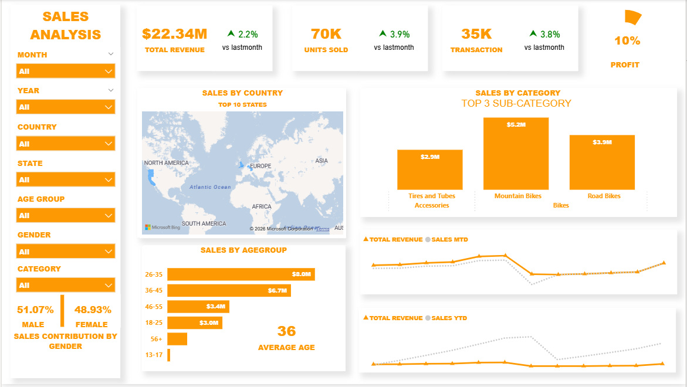

# Sales Analysis Dashboard

## Dashboard Preview

## Dashboard Overview

This project presents a Sales Analysis Dashboard built using Power BI to analyze revenue, transactions, customer demographics, and product performance.

The dashboard provides clear insights into sales trends, category performance, geographic distribution, and customer behavior to support data-driven decision-making.

## Key Business Problem

Businesses need to monitor sales performance across regions, categories, and customer segments to identify growth opportunities and improve profitability.

📈 Key Insights

💰 Total Revenue: $22.34M

📦 Units Sold: 70K

🧾 Total Transactions: 35K

📊 Profit Margin: 10%

🌍 Sales distributed across multiple countries

🚴 Top Sub-Category: Mountain Bikes ($5.2M)

👥 Gender Contribution: 51.07% Male | 48.93% Female

🎯 Average Customer Age: 36 years

## Tools & Technologies

Power BI

DAX

Data Modeling

Data Cleaning & Transformation

## Features

Dynamic filters (Month, Year, Country, State, Age Group, Gender, Category)

Revenue comparison (MTD & YTD)

Sales by Country (Map Visualization)

Sales by Age Group

Category-wise Performance Analysis

Gender-based Sales Contribution

## Dashboard Outcome

This dashboard helps stakeholders:

Track revenue growth trends

Identify top-performing products

Analyze customer demographics

Improve strategic sales planning
